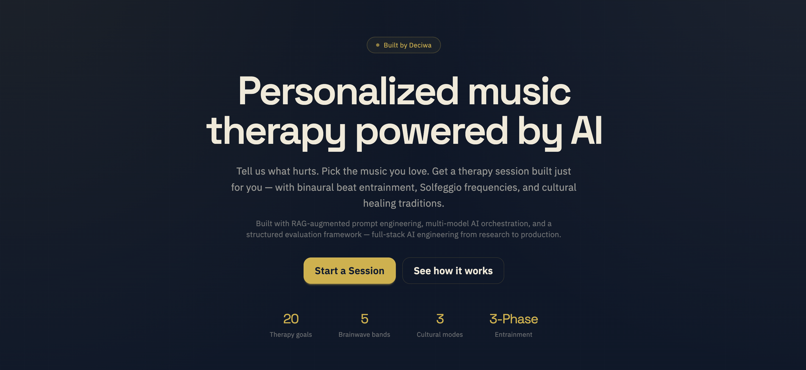
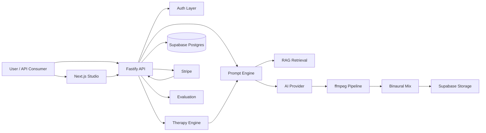

# Sonic Therapy Platform (Personalized music therapy powered by AI)

[](https://github.com/aida-solat/Ambient-Background-Music-Generator-API/actions/workflows/ci.yml)
[](https://github.com/sponsors/aida-solat)
[](https://ko-fi.com/aidaformat)
[](https://buymeacoffee.com/aidaformat)

A full-stack AI-powered music therapy platform that generates personalized therapeutic audio sessions — combining binaural beat entrainment, Solfeggio frequencies, cultural healing traditions, and AI music generation into a single product surface. Built by **Deciwa**.



Users describe their condition, choose their preferred music genre, set a session duration, and receive a scientifically-grounded therapy track tailored to their needs — complete with brainwave entrainment, frequency ramping, and optional cultural healing modes.

## Recruiter Snapshot

- **Problem solved:** music therapy tools are either basic tone generators or expensive standalone apps — none let users personalize therapeutic audio by combining their pain point, music taste, and session length into one AI-generated track
- **What was built:** therapy engine, binaural beat pipeline, ambient music generator, browser dashboard, API, auth, billing, and evaluation system
- **Why it stands out:** domain-specific audio science (brainwave entrainment, Solfeggio tones, session phasing, cultural healing modes) layered on top of full-stack product engineering — not a CRUD demo

## The Core Idea

A user says: _"I have chronic back pain, I like jazz, give me a 10-minute session."_

The platform:

1. Maps "chronic pain" to delta-wave entrainment (0.5–4 Hz) + 174 Hz Solfeggio frequency
2. Builds a therapy-aware prompt: jazz instrumentation with slow, soothing qualities
3. Generates AI music in that genre via multi-model fallback (MusicGen → OpenAI)
4. Layers binaural beats with 3-phase entrainment: induction (ramp down from alert state) → deepening (hold therapeutic frequency) → emergence (gentle ramp back to alpha)
5. Mixes Solfeggio tones at subliminal volume
6. Applies professional fades and delivers MP3 + WAV

The result is a **personalized music therapy session** — not a generic meditation track.

## Project Highlights

- **Personalized therapy sessions:** users describe their condition (20 therapeutic goals across pain, sleep, focus, emotional, and cognitive categories), choose a music genre, and set session duration — the platform generates a unique therapy track tailored to their needs
- **Binaural beat entrainment:** stereo sine tone pairs (carrier 200 Hz ± target Hz) layered under AI-generated music, with frequency targets mapped to brainwave bands (delta/theta/alpha/beta/gamma)
- **3-phase session phasing:** induction ramp (15%) → deepening hold (70%) → emergence ramp (15%) — the binaural frequency gradually shifts from alert state to therapeutic target and back, using piecewise-linear frequency sweeps via ffmpeg
- **Smart tempo:** each therapy goal maps to a research-based BPM (55–100) that complements the target brainwave band — delta goals get 55–62 BPM (parasympathetic activation), beta/gamma goals get 80–95 BPM
- **Solfeggio frequencies:** 174–963 Hz healing tones mixed at subliminal volume alongside the binaural beats when applicable
- **Cultural healing modes:** Chinese Five-Element (pentatonic scales mapped to organ systems), Indian Raga Chikitsa (classical ragas matched to time-of-day and condition), Ottoman Maqam (modal system with quarter-tone intervals) — each with goal-specific musical guidance injected into the AI prompt
- **Ambient music generation:** mood-aware, style-specific prompt engine with RAG-augmented retrieval for distinct, high-quality background music across 192+ prompt variations
- **Multi-model AI:** provider abstraction with automatic fallback (MusicGen → OpenAI), latency logging, and error aggregation
- **Evaluation framework:** 4-dimension star rating (satisfaction, mood accuracy, style accuracy, audio quality) with per-track, per-provider, and mood×style matrix aggregation
- **Full product surface:** Next.js dashboard + Fastify API + Supabase auth/storage + Stripe billing — not a prototype
- **Operational credibility:** SQL migrations, OpenAPI contract, integration tests, and CI

## Why This Project Matters

This is not a CRUD application with an AI API call bolted on. It demonstrates:

- **Domain-specific audio science:** brainwave frequency mapping, binaural beat generation, entrainment ramping, Solfeggio tone mixing — implemented from research literature, not library calls
- **Personalization engine:** the combination of therapeutic goal + music genre + duration + cultural mode creates thousands of unique session configurations
- **AI prompt engineering:** three iterations of prompt strategy (static → descriptor-based → RAG-augmented), benchmarked across 4 strategies and 6 test cases
- **Product thinking:** auth, quotas, billing, media processing, storage, delivery, evaluation, and UI — the full surface a real product requires
- **Service orchestration:** multi-step pipelines (prompt → AI generation → ffmpeg mixing → storage → signed delivery) with cleanup, error handling, and observability

## Product Surface

Two user-facing surfaces:

- **Studio dashboard** — Next.js app at `web/` for therapy sessions, ambient generation, track library, account management, and billing
- **Developer API** — Fastify backend for programmatic generation with API key auth

Frontend routes:

- `/` — landing page with therapy-first product positioning
- `/dashboard` — authenticated studio with Therapy and Ambient Music tabs
- `/docs` — engineering documentation (portfolio overview, AI notes, ADRs, blueprint)
- `/billing` — subscription plans and credit packs
- `/login` — Supabase email/password auth

## Architecture

- **Backend:** Fastify 5 + TypeScript on Node.js 24
- **Frontend:** Next.js 16 + React 19 + TailwindCSS + DaisyUI
- **Database:** Supabase Postgres with 7 migrations
- **Storage:** Supabase Storage with signed URLs (1-hour TTL)
- **Auth:** API keys for generation endpoints, Supabase sessions for dashboard
- **Billing:** Stripe checkout, billing portal, webhook reconciliation
- **AI providers:** Replicate MusicGen (primary) → OpenAI Audio (fallback) via multi-model orchestration
- **Prompt engineering:** 3-iteration strategy (static → descriptor-based → RAG-augmented), benchmarked across 4 strategies
- **RAG:** In-memory cosine similarity retrieval with IDF-weighted bag-of-tags over curated music knowledge base
- **Evaluation:** 4-dimension star ratings (satisfaction, mood accuracy, style accuracy, audio quality) with mood×style matrix
- **Audio pipeline:** ffmpeg for normalization, fades, watermarking, binaural beat mixing, Solfeggio layering, and format conversion
- **Therapy engine:** frequency mapping → session phasing → smart tempo → therapy-aware prompts → cultural healing modes → binaural mix
- **DevOps:** Docker, GitHub Actions CI, Render (API) + Vercel (frontend)

## Key Features

### Therapy Engine

- 20 therapeutic goals across 5 categories (pain, sleep, focus, emotional, cognitive)
- Brainwave frequency mapping: goals → delta/theta/alpha/beta/gamma bands
- Solfeggio frequency assignment: 174–963 Hz healing tones
- 3-phase entrainment with piecewise-linear frequency sweeps
- Smart tempo: research-based BPM per brainwave band (55–100)
- Cultural healing modes with goal-specific musical guidance
- Guided questionnaire: goal → body area/emotion → genre → culture → settings

### Ambient Music

- 8 moods × 8 styles × 3 intensities = 192+ distinct prompt variations
- RAG-augmented prompt retrieval: cosine similarity over curated musical knowledge base
- Multi-model fallback with latency tracking

### Platform

- 4-dimension track evaluation with star ratings
- Real-time generation progress with ETA
- Exclusive audio playback across tracks
- Library with search, type/mood/style filters, and pagination
- API key lifecycle (create, select, delete)
- Stripe-powered subscription plans (Free/Basic/Pro/Ultra)
- Professional fade-in (3s) and fade-out (4s) on all tracks
- Plan-aware output: watermarking, WAV access, commercial license
- Signed download URLs for MP3 and WAV

## Screenshots And Demo

The repository is ready for screenshots, but no UI captures are committed yet.

For recruiter review, the strongest visual sequence is:

- **Landing page:** therapy-first product positioning and Deciwa branding
- **Therapy questionnaire:** multi-step flow from goal selection to generation
- **Track library:** frequency metadata chips, star ratings, exclusive playback
- **Billing view:** subscription plans and billing portal

## Repository Layout

```text
src/
  services/therapy/    Frequency mapping, therapy prompt engine, binaural mix, therapy generation
  services/prompt/     Prompt engine + RAG retrieval service
  services/evaluation/ Track rating and evaluation metrics
  services/tracks/     Ambient track generation and orchestration
  services/billing/    Stripe webhooks and plan management
  services/auth/       API key and session auth
  providers/audio/     MusicGen, OpenAI, multi-provider fallback
  routes/              API endpoints
  schemas/             Fastify JSON schemas
tests/                 Integration and service tests
supabase/              Config and SQL migrations
scripts/               Prompt benchmarking and tooling
web/                   Next.js dashboard and studio
docs/                  Research, ADRs, blueprint, portfolio, AI engineering notes
openapi.yaml           Public API contract
```

## Quick Start

### Prerequisites

- Node.js `>=24`
- pnpm `>=10`
- FFmpeg on your `PATH`
- A Supabase project
- A Stripe account for billing flows
- An OpenAI-compatible audio endpoint

### Install

```bash
pnpm install
pnpm --dir web install
```

### Environment

Backend env lives in `.env.example`.

Frontend env lives in `web/.env.example`.

Minimum backend variables:

```bash
PORT=3000
SUPABASE_URL=https://your-project.supabase.co
SUPABASE_SERVICE_ROLE_KEY=your-service-role-key
STRIPE_SECRET_KEY=sk_test_xxx
STRIPE_WEBHOOK_SECRET=whsec_xxx
STRIPE_PRICE_ID_BASIC=price_basic_xxx
STRIPE_PRICE_ID_PRO=price_pro_xxx
STRIPE_PRICE_ID_ULTRA=price_ultra_xxx
OPENAI_API_KEY=sk-openai-xxx
OPENAI_AUDIO_ENDPOINT=https://api.openai.com/v1/audio/generations
WATERMARK_FILE_PATH=/absolute/path/to/watermark.wav
```

Minimum frontend variables:

```bash
NEXT_PUBLIC_API_BASE_URL=http://localhost:3000
NEXT_PUBLIC_SUPABASE_URL=https://your-project.supabase.co
NEXT_PUBLIC_SUPABASE_ANON_KEY=your-supabase-anon-key
```

### Database Setup

This repo uses sequential SQL migrations under `supabase/migrations/`.

Apply them to the linked Supabase project:

```bash
supabase db push
```

Current migrations:

- `0001_init.sql`
- `0002_increment_usage_daily_rpc.sql`
- `0003_add_wav_storage_path.sql`
- `0004_add_track_ratings.sql`
- `0005_add_track_type.sql`
- `0006_remove_track_limits.sql`
- `0007_add_therapy_frequency.sql`

### Run the App

Backend:

```bash
pnpm dev
```

Frontend:

```bash
pnpm web:dev
```

Production build:

```bash
pnpm build
pnpm web:build
```

## Quality Checks

Backend validation:

```bash
pnpm lint
pnpm typecheck
pnpm build
CI=1 pnpm exec vitest --run --watch=false
```

Frontend validation:

```bash
pnpm web:typecheck
pnpm web:build
```

## Auth Model

Two auth modes reflecting a realistic product architecture:

- **API keys** for `/api/generate`, `/api/generate/therapy`, `/api/me`, and `/api/keys` — developer surface
- **Supabase bearer sessions** for `/api/account/*` — dashboard surface

## API Surface

Primary routes:

- `POST /api/generate` — ambient music generation
- `POST /api/generate/therapy` — therapeutic session generation
- `GET /api/me` — usage and plan info
- `POST /api/keys` — create API key
- `GET /api/account/me` — account details
- `GET /api/account/keys` / `POST` / `DELETE` — key management
- `GET /api/account/tracks` — track library
- `DELETE /api/account/tracks/:trackId` — delete a track (storage + DB)
- `POST /api/account/tracks/:trackId/rate` — rate a track
- `GET /api/account/tracks/:trackId/evaluation` — track evaluation summary
- `POST /api/account/billing/checkout-session` — Stripe checkout
- `POST /api/account/billing/portal-session` — Stripe billing portal
- `POST /webhooks/stripe` — payment webhooks
- `GET /healthz` — health check

See `openapi.yaml` for the full contract.

## Deployment

Requires a long-running server (ffmpeg child processes, temp filesystem, webhook handling).

Suitable targets: Render, Docker on a VM.

```bash
stripe listen --forward-to localhost:3000/webhooks/stripe
```

## Portfolio Review Guide

**Start here** — the most interesting code to inspect:

| Area                  | File                                               | Why it matters                                      |
| --------------------- | -------------------------------------------------- | --------------------------------------------------- |
| Therapy engine        | `src/services/therapy/frequencyMappingService.ts`  | Brainwave mapping, session phasing, smart tempo     |
| Binaural mixing       | `src/services/therapy/binauralMixService.ts`       | ffmpeg binaural beat + Solfeggio mixing             |
| Therapy prompts       | `src/services/therapy/therapyPromptEngine.ts`      | Therapy-aware prompts with cultural healing modes   |
| Service orchestration | `src/services/tracks/generateTrackService.ts`      | Multi-step pipeline with cleanup and error handling |
| Prompt engineering    | `src/services/prompt/promptEngine.ts`              | Mood/style/intensity-aware descriptors              |
| RAG retrieval         | `src/services/prompt/promptRetrieval.ts`           | Cosine similarity over musical knowledge base       |
| Multi-model fallback  | `src/providers/audio/multiProviderWithFallback.ts` | Sequential fallback with observability              |
| Track evaluation      | `src/services/evaluation/evaluationService.ts`     | 4-dimension ratings + mood×style matrix             |
| Dashboard             | `web/components/dashboard-app.tsx`                 | Full studio UX                                      |
| Therapy UI            | `web/components/therapy-panel.tsx`                 | Multi-step questionnaire                            |

Run `npx tsx scripts/benchmark-prompts.ts` to see prompt strategy comparison across 4 strategies and 6 test cases.

## High-Level Architecture



## Author

Built by **Deciwa**.

## Support This Project

Sonic Therapy is a production-grade music therapy platform built on real audio science — not a CRUD demo with an AI API call bolted on. If this project is useful to you, or you want to see it grow, please consider sponsoring.

### Why it's worth supporting

- Binaural beat engine, Solfeggio frequency mixing, and 3-phase entrainment written from research papers — no library calls
- RAG-augmented prompt retrieval, multi-model AI fallback, evaluation framework, and cultural healing modes
- Complete product surface: auth, billing, storage, delivery, and studio UI — the full stack a real product requires

### Sponsorship tiers

| Tier | Monthly | Benefits |
|------|---------|----------|
| ☕ Coffee | $5 | Your name in the Backers section |
| ⭐ Supporter | $15 | Name in README + priority Issues |
| 🚀 Pro | $50 | Monthly pair programming / code review session |
| 💎 Partner | $200 | White-label license discussion + consulting call |

**Corporate tiers** (logo in README, commercial license, dedicated support) are available — see [SPONSORS.md](SPONSORS.md) for details.

### How to sponsor

[](https://github.com/sponsors/aida-solat)
[](https://ko-fi.com/aidaformat)
[](https://patreon.com/aidaformat)
[](https://buymeacoffee.com/aidaformat)

## Backers

*Be the first to support Sonic Therapy!*

<!-- BACKERS:START -->
<!-- BACKERS:END -->

## License

MIT
